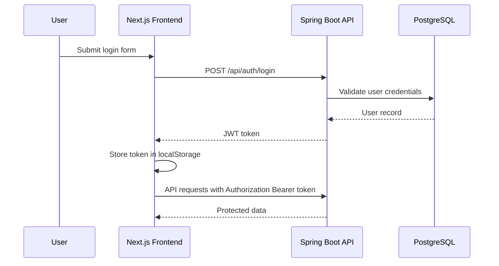
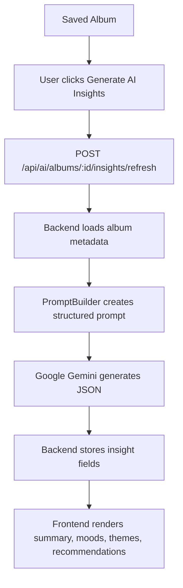

# 🎧 TrackIQ — Music Catalog Insights Platform

<p align="center">
  <strong>A full-stack music library app for discovering albums, saving a personal catalog, visualizing listening-library analytics, and generating AI-powered album insights.</strong>
</p>

<p align="center">
  
  
  
  
  
  
  
</p>

---

## ✨ Overview

**TrackIQ** is a take-home assignment implementation for a **Music Catalog Insights Platform**. It integrates with the public **iTunes Search API** so users can search albums, save selected albums into their own authenticated library, edit personal metadata, explore analytics, and request AI-generated album insights.

The project is intentionally split into:

- `backend/` — Java 21 + Spring Boot REST API
- `frontend/` — Next.js + React dashboard UI
- `docker-compose.yml` — local PostgreSQL, backend, and frontend orchestration

---

## 🎯 Entity Choice

### Chosen focus: **Albums**

I chose **Albums** because they provide richer analytical dimensions than single tracks while staying scoped enough for a three-day assignment:

- Albums naturally include `artistName`, `genre`, `releaseDate`, `trackCount`, and artwork.
- They make analytics more meaningful: genre distribution, release-year trends, top artists, and rating histograms.
- AI summaries work well at the album level because an album has a stronger creative identity than an isolated song result.

---

## 🚀 Features

### Authentication

- User registration and login
- JWT-based authentication
- Authenticated `/api/users/me` endpoint
- Frontend stores and sends bearer tokens through an Axios interceptor

### iTunes Catalog Search

- Search albums from the public iTunes Search API
- Fetch album details by Apple collection ID
- Save iTunes albums directly into the authenticated user’s library
- Prevent duplicate saved albums per user with a database unique constraint

### Personal Library

- Paginated saved album list
- Search/filter saved albums in the UI
- View album detail pages
- Update personal album fields:
  - Rating
  - Notes
  - Favourite flag
- Delete saved albums

### Analytics Dashboard

Implemented with **Recharts**:

| Chart | Insight |
|---|---|
| Donut/Pie chart | Genre breakdown |
| Horizontal bar chart | Top artists |
| Bar chart | Releases by year |
| Histogram-style bar chart | Rating distribution |

### AI Feature — Album Insights Engine

The AI feature generates structured insights for a saved album using **Google Gemini**.

Generated fields:

- `summary`
- `moods`
- `themes`
- `recommendedFor`
- `similarArtists`

Insights can be fetched from the saved album record or refreshed on demand.

### UI/UX

- Responsive dashboard layout
- Neobrutalist visual style
- Loading states
- Empty states
- Toast notifications
- Sidebar navigation
- Auth pages
- Album detail page with AI insight card

---

## 🧱 Tech Stack

### Backend

| Area | Technology |
|---|---|
| Language | Java 21 |
| Framework | Spring Boot 3.5.5 |
| API | Spring Web MVC |
| Auth | Spring Security + JWT |
| ORM | Spring Data JPA / Hibernate |
| Validation | Jakarta Bean Validation |
| Database | PostgreSQL |
| API Docs | Springdoc OpenAPI / Swagger UI |
| AI | Google GenAI SDK / Gemini |
| Build | Maven |

### Frontend

| Area | Technology |
|---|---|
| Framework | Next.js 16 |
| UI Library | React 19 |
| Styling | Tailwind CSS 4 |
| Components | shadcn-style local components, Radix UI |
| Charts | Recharts |
| HTTP Client | Axios |
| Icons | Lucide React |
| Notifications | Sonner |
| Language | TypeScript |

### Infrastructure

| Area | Technology |
|---|---|
| Database | PostgreSQL 17 |
| Containers | Docker + Docker Compose |
| Backend Runtime | Eclipse Temurin Java 21 |
| Frontend Runtime | Node 22 Alpine |

---

## 🗂️ Project Structure

```txt
music-streaming/
├── backend/
│   ├── src/main/java/com/musiccatalog/
│   │   ├── ai/             # Gemini client, prompts, AI controller/service
│   │   ├── album/          # Album CRUD, entity, DTOs, repository, specs
│   │   ├── analytics/      # Analytics controllers/services/repositories
│   │   ├── auth/           # Register/login DTOs and auth service
│   │   ├── common/         # Base entity and centralized exceptions
│   │   ├── itunes/         # iTunes proxy/search/save integration
│   │   ├── security/       # JWT/security configuration
│   │   └── user/           # User entity and current-user endpoint
│   ├── src/main/resources/application.properties
│   ├── Dockerfile
│   └── pom.xml
│
├── frontend/
│   ├── app/
│   │   ├── (auth)/login
│   │   ├── (auth)/register
│   │   └── dashboard/
│   │       ├── analytics
│   │       ├── explore
│   │       ├── saved
│   │       └── albums/[id]
│   ├── api/                # Typed API wrappers
│   ├── components/         # Feature and UI components
│   ├── lib/                # Axios config, auth helpers, utils
│   ├── types/              # Shared frontend TypeScript types
│   ├── Dockerfile
│   └── package.json
│
├── docker-compose.yml
└── README.md
```

---

## 🗄️ Database & Schema

### Database choice: **PostgreSQL**

PostgreSQL was chosen because it is reliable, widely supported by Spring Data JPA, easy to run locally through Docker, and well-suited for relational user-owned library data.

The application stores **only the user’s saved library**, not the entire third-party catalog.

### Core tables

#### `users`

| Column | Purpose |
|---|---|
| `id` | Primary key |
| `username` | Unique display/login identity |
| `email` | Unique email |
| `password_hash` | Hashed password |
| `created_at` | Audit timestamp |
| `updated_at` | Audit timestamp |

#### `albums`

| Column | Purpose |
|---|---|
| `id` | Internal primary key |
| `user_id` | Owner of the saved album |
| `apple_catalog_id` | iTunes/Apple collection ID |
| `title` | Album title |
| `artist_name` | Artist name |
| `genre` | Primary genre |
| `release_date` | Album release date |
| `track_count` | Number of tracks |
| `artwork_url` | Album artwork URL |
| `user_rating` | User rating |
| `user_notes` | Personal notes |
| `favourite` | User favourite flag |
| `ai_summary` | Generated AI summary |
| `ai_moods` | Generated moods |
| `ai_themes` | Generated themes |
| `ai_recommended_for` | Generated recommendation tags |
| `ai_similar_artists` | Generated similar artists |
| `ai_generated_at` | AI generation timestamp |
| `created_at` | Audit timestamp |
| `updated_at` | Audit timestamp |

A unique constraint prevents the same user from saving the same Apple album twice:

```java
@UniqueConstraint(columnNames = {"user_id", "apple_catalog_id"})
```

---

## 🔌 REST API

Base URL locally:

```txt
http://localhost:8080/api
```

Swagger/OpenAPI:

```txt
http://localhost:8080/swagger-ui/index.html
http://localhost:8080/v3/api-docs
```

### Auth

| Method | Endpoint | Description |
|---|---|---|
| `POST` | `/api/auth/register` | Create a user |
| `POST` | `/api/auth/login` | Login and receive JWT |
| `GET` | `/api/users/me` | Get current authenticated user |

### iTunes integration

| Method | Endpoint | Description |
|---|---|---|
| `GET` | `/api/itunes/search?term=coldplay` | Search iTunes albums |
| `GET` | `/api/itunes/albums/{collectionId}` | Lookup a specific iTunes album |
| `POST` | `/api/itunes/albums/{collectionId}/save` | Save an iTunes album to the user library |

### Album library

| Method | Endpoint | Description |
|---|---|---|
| `GET` | `/api/albums` | Paginated saved albums with filters |
| `POST` | `/api/albums` | Create a saved album manually |
| `GET` | `/api/albums/{albumId}` | Get one saved album |
| `PUT` | `/api/albums/{albumId}` | Update rating, notes, favourite |
| `DELETE` | `/api/albums/{albumId}` | Delete saved album |

Supported library query options include:

```txt
page=0
size=10
sortBy=createdAt
direction=desc
filter.title=...
filter.artist=...
filter.genre=...
filter.favourite=true
filter.rating=5
```

### Analytics

| Method | Endpoint | Description |
|---|---|---|
| `GET` | `/api/analytics/genres` | Count albums by genre |
| `GET` | `/api/analytics/artists` | Count albums by artist |
| `GET` | `/api/analytics/ratings` | Count albums by user rating |
| `GET` | `/api/analytics/releases` | Count albums by release year |

### AI insights

| Method | Endpoint | Description |
|---|---|---|
| `GET` | `/api/ai/albums/{albumId}/insights` | Get saved AI insights |
| `POST` | `/api/ai/albums/{albumId}/insights/refresh` | Generate or refresh AI insights |

Example AI response:

```json
{
  "summary": "A concise critic-style description of the album.",
  "moods": ["reflective", "anthemic"],
  "themes": ["nostalgia", "resilience"],
  "recommendedFor": ["late-night listening", "fans of melodic rock"],
  "similarArtists": ["Keane", "Snow Patrol"]
}
```

---

## 🔐 Authentication Flow



---

## 🧠 AI Insight Flow



---

## ⚙️ Local Setup

### Prerequisites

- Java 21+
- Maven 3.9+
- Node.js 22+
- npm
- Docker + Docker Compose
- Google Gemini API key for AI insight generation

---

## 🐳 Run with Docker Compose

From the repository root:

```bash
docker compose up --build
```

Services:

| Service | URL |
|---|---|
| Frontend | `http://localhost:3000` |
| Backend API | `http://localhost:8080/api` |
| Swagger UI | `http://localhost:8080/swagger-ui/index.html` |
| PostgreSQL | `localhost:5432` |

The compose file starts:

- `postgres` using PostgreSQL 17
- `backend` on port `8080`
- `frontend` on port `3000`

> Note: `docker-compose.yml` expects a backend env file at `backend/.env`.

Create `backend/.env`:

```env
POSTGRES_DB=music_catalog
POSTGRES_USER=music_user
POSTGRES_PASSWORD=password
JWT_SECRET=replace-with-a-long-secure-secret-key
JWT_EXPIRATION=86400000
GOOGLE_API_KEY=replace-with-your-google-gemini-api-key
```

---

## 🧑‍💻 Run Manually

### 1. Start PostgreSQL

You can run only the database through Docker:

```bash
docker compose up postgres
```

Or provide your own PostgreSQL instance with:

```txt
Database: music_catalog
User: music_user
Password: music_password
Port: 5432
```

### 2. Configure backend environment

The backend reads configuration from environment variables:

```env
DB_HOST=localhost
DB_PORT=5432
POSTGRES_DB=music_catalog
POSTGRES_USER=music_user
POSTGRES_PASSWORD=music_password
JWT_SECRET=replace-with-a-long-secure-secret-key
JWT_EXPIRATION=86400000
GOOGLE_API_KEY=replace-with-your-google-gemini-api-key
```

### 3. Run backend

```bash
cd backend
mvn spring-boot:run
```

Backend runs on:

```txt
http://localhost:8080
```

### 4. Configure frontend

Create `frontend/.env.local`:

```env
NEXT_PUBLIC_API_URL=http://localhost:8080/api
```

### 5. Run frontend

```bash
cd frontend
npm install
npm run dev
```

Frontend runs on:

```txt
http://localhost:3000
```

---

## 🧪 Useful Commands

### Backend

```bash
cd backend
mvn test
mvn clean package
mvn spring-boot:run
```

### Frontend

```bash
cd frontend
npm run dev
npm run build
npm run lint
npm run typecheck
npm run format
```

---

## 🌐 Deployment

Suggested deployment split:

| Layer | Option |
|---|---|
| Frontend | Vercel / Netlify |
| Backend | Render / Railway / AWS / Fly.io |
| Database | Railway PostgreSQL / Render PostgreSQL / Supabase / Neon |

### Deployment environment variables

Backend:

```env
DB_HOST=
DB_PORT=5432
POSTGRES_DB=
POSTGRES_USER=
POSTGRES_PASSWORD=
JWT_SECRET=
JWT_EXPIRATION=86400000
GOOGLE_API_KEY=
```

Frontend:

```env
NEXT_PUBLIC_API_URL=https://your-backend-domain.com/api
```

### Live links

> Replace these once deployed.

- Frontend: `TODO: add deployed frontend URL`
- Backend API: `TODO: add deployed backend URL`
- Swagger/OpenAPI: `TODO: add deployed Swagger URL if exposed`

---

## 📸 Screenshots

> Add screenshots or GIFs here after deployment/demo recording.

Suggested screenshots:

| Page | Description |
|---|---|
| Welcome | Landing page |
| Login/Register | Authentication flow |
| Explore Catalog | iTunes album search |
| Saved Library | User’s saved albums |
| Album Detail | Notes, rating, AI insights |
| Analytics | Genre, artist, release, and rating charts |

---

## ✅ Assignment Requirement Mapping

| Requirement | Status | Implementation |
|---|---:|---|
| Pick one entity | ✅ | Albums |
| Store saved user library | ✅ | PostgreSQL `albums` table |
| REST API | ✅ | Auth, iTunes, album CRUD, analytics, AI endpoints |
| Centralized error handling | ✅ | `GlobalExceptionHandler` and custom exceptions |
| Validation | ✅ | Jakarta validation DTO constraints |
| JWT authentication | ✅ | Spring Security + JWT |
| Search page | ✅ | `/dashboard/explore` |
| Library page | ✅ | `/dashboard/saved` |
| Analytics dashboard | ✅ | `/dashboard/analytics` |
| Responsive UI | ✅ | Next.js + Tailwind layout/components |
| Loading/empty states | ✅ | Search, library, analytics, AI states |
| At least 4 charts | ✅ | Donut, horizontal bar, release bar, rating histogram |
| AI feature | ✅ | Gemini-powered album insights |
| Deployment | ⏳ | Deployment URLs to be added |
| README | ✅ | This file |
| Good to have: pagination | ✅ | Saved library pagination |
| Good to have: API docs | ✅ | OpenAPI/Swagger |
| Good to have: Docker | ✅ | Dockerfiles + Compose |

---

## ⚖️ Trade-offs & Notes

- **Albums only:** The project focuses on albums to keep the data model and UX coherent within the assignment timeline.
- **Only saved library is persisted:** iTunes remains the source of truth for public catalog search; the database stores only user-selected albums and user-specific metadata.
- **AI data is denormalized on albums:** Insight fields are stored on the album row for simplicity. A separate `album_insights` table would be cleaner if insight history/versioning were required.
- **Frontend auth token storage:** The frontend uses `localStorage` for simplicity. In production, an HTTP-only secure cookie strategy would reduce XSS token exposure risk.
- **Docker Compose API URL:** The compose file sets `NEXT_PUBLIC_API_URL=http://backend:8080/api`, which is suitable from inside the Docker network. For browser access in some setups, `http://localhost:8080/api` may be required at build time depending on deployment topology.
- **AI requires a secret:** Gemini insight generation requires `GOOGLE_API_KEY`. The rest of the app can still work without AI if that endpoint is not used/configured.

---

## 🔮 Future Improvements

- Debounced catalog search
- Server-side saved library filters wired into the frontend controls
- Unit/integration tests for controllers and services
- Refresh-token based auth
- Album insight history/versioning
- Duplicate detection dashboard
- Caching iTunes search results
- More analytics: average rating by genre, favourite ratio, decade buckets
- CI pipeline for lint, tests, and Docker builds

---

## 👤 Author

Built as a full-stack take-home assignment for the **Music Catalog Insights Platform** prompt.

- GitHub Repository: `TODO: add GitHub repository URL`
- Live Demo: `TODO: add live deployment URL`
